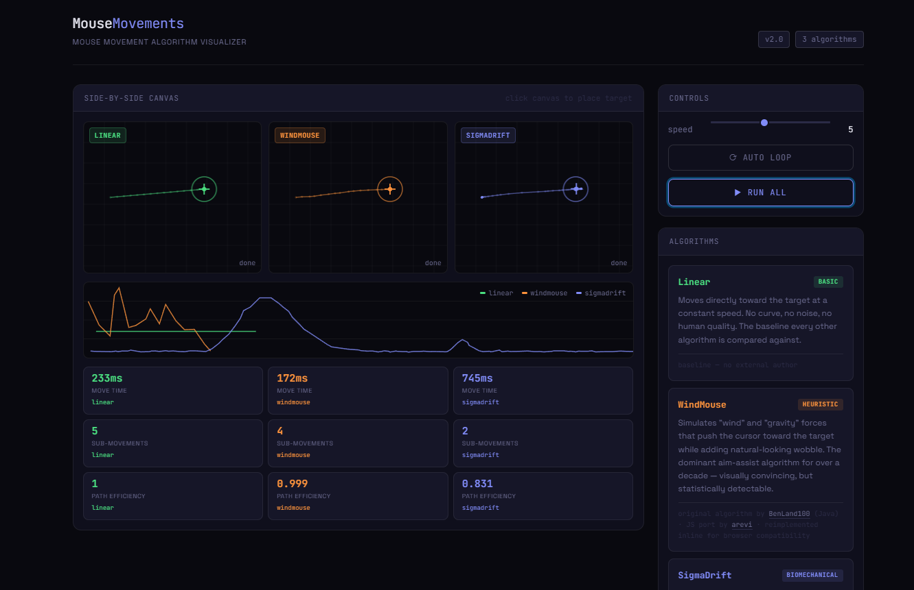

# MouseMovements

An interactive, side-by-side visualizer for three mouse movement algorithms — from a simple linear baseline to a full biomechanical model.

## Algorithms

### Linear *(baseline)*
Moves directly toward the target at a constant speed. No curve, no noise, no human quality. Every other algorithm is compared against this.

### WindMouse *(heuristic)*
Simulates **wind** and **gravity** forces that push the cursor toward the target while adding natural-looking wobble. The dominant aim-assist algorithm for over a decade — visually convincing, but statistically detectable.

> Original algorithm by **[BenLand100](https://github.com/BenLand100)** (Java)  
> JavaScript port by **[arevi](https://github.com/arevi/wind-mouse)**  
> Reimplemented inline for browser compatibility in this visualizer

### SigmaDrift *(biomechanical)*
A biomechanically-grounded model built on Plamondon's **Kinematic Theory** with six interacting motor-control components:
- Sigma-lognormal velocity primitives
- Fitts' Law movement-time prediction
- Ornstein-Uhlenbeck drift
- Signal-dependent noise
- Physiological tremor
- Gamma-distributed sampling intervals

> Algorithm, research & C++ source by **[ck0i](https://github.com/ck0i)**  
> Paper: [zenodo.org/records/18872499](https://zenodo.org/records/18872499)  
> Ported to JavaScript for this visualizer

---

## Features

- **Side-by-side canvas** — all three algorithms run simultaneously so differences are immediately visible
- **Velocity graph** — overlaid speed-over-time curves for each algorithm
- **Stats bar** — move time, sub-movements, and path efficiency after each run
- **Speed control** — one slider that scales movement time across all algorithms
- **Auto loop** — toggle continuous animation without user input
- **Click to place target** — click anywhere on a canvas to set a new destination and run instantly

## Stack

- [Vite](https://vitejs.dev/) — build tooling
- [Pico CSS](https://picocss.com/) — classless CSS base
- Vanilla JavaScript — no framework

## Credits

| Algorithm | Author | Source |
|---|---|---|
| WindMouse | [BenLand100](https://github.com/BenLand100), JS port by [arevi](https://github.com/arevi/wind-mouse) | GitHub |
| SigmaDrift | [ck0i](https://github.com/ck0i) | [Zenodo paper](https://zenodo.org/records/18872499) |
| Linear | — | baseline, no external author |
